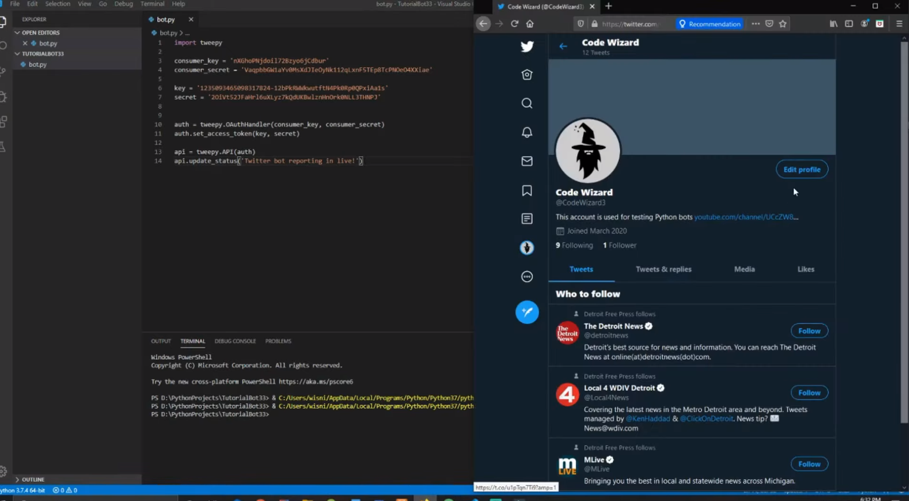

# TwitterBot
This bot will get Twitter users more followers by increasing attention and engagement through its ability to auto retweet and auto like a status, auto tag users, auto reply to tags/comments, and auto reply to direct messages.

I used VSCode, Tweepy, and the Twitter Developer API to create this bot. There is a full tutorial and demo on my YouTube channel located here: https://youtu.be/ewq-91-e2fw

